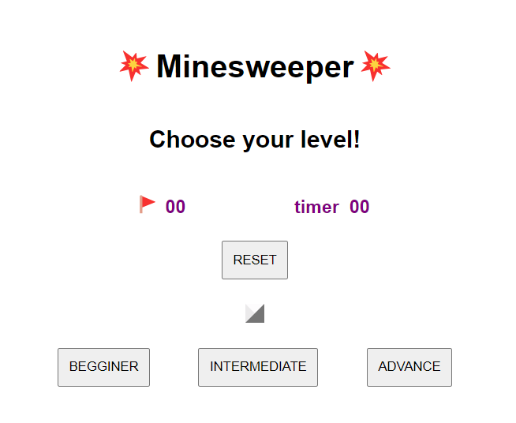
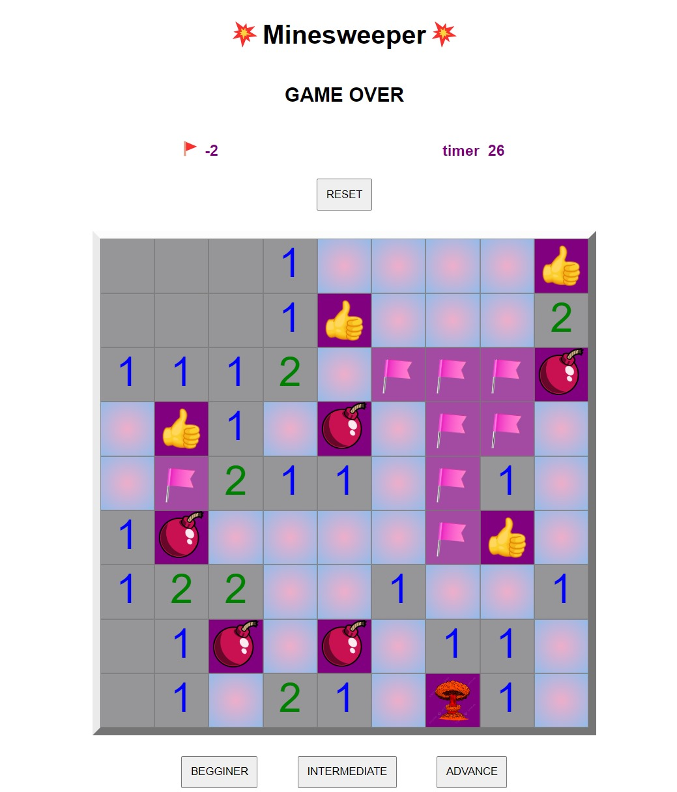

# Minesweeper

This is a game that consists of going through a minefield without exploding into **small pieces**.

Of course you will have some help, every time you step on a box, if it is not a mine, the boxes will open for you and tell you how many mines are nearby.

If you suspect you have a mine right under your nose, you can always mark it, as a precaution.

You will only win if you manage to sweep the entire board without exploding.

Think you've got what it takes?
Want to try your luck? [click here](https://melaniemsc.github.io/Minesweeper/)

## This is MY Version of the Game

First of all, you need to **choose your level**

If you feel brave enough, you can always choose advanced, otherwise, the begginer may be adequate.

### Star of the Game 
As I said before, you will be given a board (depending on the level) all covered, your job to uncover it all

The first time you click on a box the timer will start (pray that the first box is not a bomb).
When you click, if the box is a number it will only reveal that number and tell you how many bombs it has around it and if you click on an empty box it will reveal everything around it until it reaches a number.

### Flag a Box
If you want to feel safe, you can put a flag to mark a possible bomb, you can put as many flags as you want but you won't win just by putting flags all over the place.

### Bombs and Game Over
Bombs are placed randomly inside the board every time you start a new game. 
If you touch a bomb it's instant game over, the timer will stop and the board will show you which bomb you exploded, where the other bombs were and which ones were defused correctly.

### Winner
you can declare yourself **the winner** if and only if you managed to unlock **ALL** the board without touching a single bomb in your game.

## Making of the Game

The technologies used to make this game were **JavaScript, HTML and CSS**

I am very happy with the result of this game, if you had told me a week ago that I could have made something like this I wouldn't have believed it.
I remember choosing Minesweeper because I wanted "a bit of a challenge" and at the time the recursion seemed amazing and mindblowing, but honestly it didn't seem so complicated in the end.

I do remember being stuck for a good part of the time on something that my code wasn't reading correctly and it turned out to be a silly thing that solved it, but the reaffirmation after it was solved that my logic and the way I wrote it did work correctly was spectacular.

Thank you so much for stopping by to read all this and I hope you enjoy my game <3

Translated with www.DeepL.com/Translator (free version)